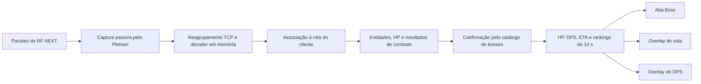

# Como funciona o Monitor Boss do RF QOL

Estado documentado: RF QOL 1.0.11.

## Objetivo

O Monitor Boss acompanha bosses confirmados próximos aos clientes selecionados.
Ele mostra vida, porcentagem de HP, DPS estimado, tempo restante e o dano
observado por jogador, guilda e grupo nos últimos 10 segundos.

O monitor usa captura passiva de rede. Ele não lê a memória do processo do
jogo, não injeta código no cliente e não usa reconhecimento de imagem.

## Fluxo dos dados



O payload sensível `0x0101` é descartado antes da criação dos eventos usados
pelos monitores.

## Ativação e licença

- A licença precisa incluir o módulo `monitor-boss`.
- Sem esse módulo, a aba Boss fica invisível e os controles e overlays são
  desativados.
- O usuário escolhe a aba do cliente PC ou emulador e liga o monitor para essa
  rota.
- Ao contrário do Monitor PvP, o Monitor Boss pode permanecer ligado em mais de
  um cliente ao mesmo tempo, dentro dos limites da licença.
- O intervalo padrão é 2 segundos e pode ser configurado entre 1 e 60 segundos.
- O estado ligado/desligado é separado por cliente.

Quando o **Modo foco** do Boss está marcado, o Monitor Boss continua usando seu
intervalo rápido, mas as leituras gerais não relacionadas aos monitores são
adiadas para pelo menos 5 minutos. Isso reduz trabalho concorrente sem descartar
pacotes do monitor.

## Como um boss é reconhecido

1. O decoder recebe uma aparição de monstro e extrai UID de combate,
   `npc_index`, HP atual, HP máximo e demais campos confirmados.
2. O `npc_index` precisa existir em `core/boss_catalog.csv`.
3. O boss precisa estar vivo, com HP diferente de zero e ter confirmação
   recente.
4. A entidade é associada à rota do cliente pelas portas e pelo fluxo de rede.

Um monstro que não esteja no catálogo não é promovido para a lista de bosses.
O nome e o nível vêm do catálogo; a vida e os danos vêm dos eventos observados
no tráfego do jogo.

O nome do boss segue a opção de idioma dos **dados do jogo**:

- Português: usa primeiro `name_ptbr` e depois o nome em inglês como fallback.
- Inglês: usa primeiro `name_en` e depois o nome em português como fallback.
- A interface, botões e mensagens permanecem em português.

## Vida e expiração

O HP é atualizado por aparições, sincronizações de HP e resultados confirmados
de habilidades ou ataques. A porcentagem é calculada assim:

```text
HP% = HP atual / HP máximo × 100
```

O boss deixa o snapshot quando ocorre uma destas situações:

- morte confirmada;
- HP atual igual a zero;
- desaparecimento da entidade;
- ausência de atualização válida por mais de 15 segundos.

O stream mantém âncoras e eventos de boss por mais tempo para reconstruir o
estado, mas a interface só aceita como próximo um boss ainda vivo e confirmado
nos últimos 15 segundos.

## DPS total e tempo restante

O **DPS estimado do boss** representa a queda líquida do HP dentro de uma janela
móvel de 10 segundos. São necessários ao menos dois valores diferentes de HP.

```text
DPS estimado = (primeiro HP - último HP) / tempo decorrido
Tempo restante = HP atual / DPS estimado
```

Se não existirem duas leituras úteis, o programa mostra DPS e tempo restante
como `—`. Se houver leituras, mas não existir queda líquida de HP, o DPS fica em
zero e somente o tempo restante aparece como `—`. Cura ou recuperação de HP pode
reduzir a estimativa, pois esse número mede a variação líquida da vida do boss.

O tempo restante é apenas uma projeção baseada no ritmo recente. Ele não prevê
mudança de fase, invulnerabilidade, cura, aumento ou queda futura do DPS.

## Dano por jogador, guilda e grupo

O ranking usa somente resultados de combate bem-sucedidos que informem:

- UID do atacante;
- UID do boss atingido;
- dano de HP confirmado;
- horário do evento.

Cada ranking considera os últimos 10 segundos:

- **Jogadores:** soma o dano de cada atacante e calcula seu DPS; exibe até os
  10 maiores.
- **Guildas:** agrega todos os eventos pelos identificadores de guilda, calcula
  dano e DPS próprios e ordena as colunas pelo DPS da guilda.
- **Grupos:** agrega os eventos pelo identificador de grupo/party e exibe até os
  10 maiores.

O DPS da guilda é calculado diretamente com todos os eventos observados daquela
guilda na janela. Ele não é reconstruído pela soma de um ranking visual já
limitado.

Na interface atual, as colunas são abertas a partir dos jogadores presentes no
Top 10 individual. Por isso, uma guilda pode ter sido contabilizada no resumo
agregado, mas não ganhar uma coluna própria se nenhum integrante estiver nesse
Top 10.

Quando o jogador está identificado, mas a guilda não está disponível, ele é
mostrado na coluna **Sem guilda**. Informações locais já conhecidas podem
completar nome e guilda antes da apresentação, mas o programa não inventa uma
associação ausente.

## O que aparece na aba Boss

Cada boss confirmado recebe um cartão contendo:

- ícone, quando existe um asset associado ao `npc_index`;
- nome e nível;
- HP atual, HP máximo e porcentagem;
- idade da última atualização;
- DPS estimado e tempo restante;
- colunas de dano por guilda;
- jogadores agrupados dentro de cada guilda;
- ranking de DPS por grupo;
- barra visual de vida.

Mais de um boss pode aparecer ao mesmo tempo. A lista é ordenada primeiro pela
confirmação mais recente e depois pelo nome.

## Overlays

O monitor possui dois overlays independentes:

### Overlay de vida

Mostra:

- nome do boss;
- personagem/cliente vinculado à leitura;
- HP atual e máximo;
- barra de vida.

### Overlay de DPS

Mostra:

- nome do boss;
- personagem/cliente vinculado à leitura;
- DPS estimado;
- tempo restante no formato `MM:SS`.

Os dois overlays:

- permanecem acima das outras janelas;
- não precisam que a janela principal fique restaurada;
- podem ser arrastados com o botão esquerdo;
- salvam suas posições separadamente;
- voltam para a posição salva quando forem reabertos.

Quando existem bosses em várias rotas, o overlay prioriza um boss do cliente
selecionado na interface. Dentro dessa rota, usa o boss confirmado mais
recentemente. Se a rota selecionada não possuir boss, usa o mais recente entre
as demais rotas presentes no snapshot.

## Alerta de boss

Em **Alertas**, a opção **Avisar ao detectar boss próximo** gera um aviso para
cada boss confirmado. O mesmo boss respeita um intervalo mínimo de 10 segundos
entre alertas para evitar repetição excessiva.

## Limitações conhecidas

- O monitor só contabiliza pacotes recebidos e decodificados naquela rota.
- Participantes invisíveis, eventos perdidos ou campos ainda não decodificados
  não entram no ranking.
- Um jogador pode aparecer como **Não identificado** ou **Sem guilda** quando a
  aparição ou a relação de guilda não foi observada.
- O ranking é uma janela móvel de 10 segundos, não o acumulado completo da luta.
- Um boss sem atualização por 15 segundos desaparece mesmo que ainda esteja vivo
  no servidor; ele volta quando houver nova confirmação válida.
- Com o Boss ligado em ao menos um cliente, o snapshot é reconstruído para todas
  as rotas conhecidas. Atualmente, o fallback do overlay e o alerta podem usar
  um boss de outra rota mesmo que o botão Boss daquela rota esteja desligado.
- Recompensas, recebedores e regras internas de fases do boss não fazem parte
  deste monitor.
- O Banco PvP está temporariamente desativado na versão 1.0.11. Isso não desliga
  o Monitor Boss; dados locais já existentes podem ser usados somente para
  enriquecer nomes e guildas exibidos.

## Diagnóstico rápido

### O boss não aparece

1. Confirme que a licença inclui **Monitor Boss**.
2. Ligue o monitor na aba do cliente correto.
3. Confirme que o personagem está conectado e recebendo tráfego do jogo.
4. Verifique se o boss está no catálogo e se houve uma aparição válida.
5. Consulte o log detalhado para fila, atraso, erros de decode e associação da
   rota.

### O DPS aparece como `—`

São necessárias pelo menos duas mudanças de HP confirmadas. Aguarde novos danos
ou verifique se os pacotes de resultado de combate estão chegando.

### Faltam jogadores ou guildas

O ranking não completa identidades por suposição. O nome e a guilda aparecem
quando os respectivos dados forem observados no fluxo ou já existirem no
histórico local confiável.

## Referências da implementação

- `core/live_stream.py`: retenção dos eventos e âncoras de boss em memória.
- `core/combat_monitor.py`: estado, HP, expiração, DPS, ETA e rankings.
- `core/boss_catalog.csv`: catálogo bilíngue de bosses confirmados.
- `app/ui_qt/data.py`: carregamento do catálogo e criação dos snapshots.
- `app/ui_qt/main.py`: licença, intervalos, modo foco, página, alertas e
  overlays.
