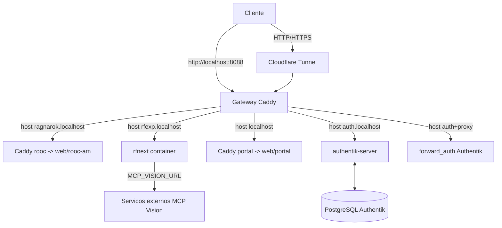

# Documento Tecnico - Plataforma Karvalho

## 1) Escopo

Este documento descreve a arquitetura atual do projeto Karvalho no diretório atual (`C:\Users\celc3\OneDrive\Documentos\Site`) e os fluxos operacionais obrigatorios para manter, publicar e operar os servicos.

## 2) Arquitetura geral

Projeto com foco em:

- hosting local por Docker Compose;
- exposicao externa via Cloudflare Tunnel (opcional por profile `tunnel`);
- roteamento por host com Caddy;
- acesso protegido por Authentik para rotas internas;
- servico de conteudo estatico (portal + ROOC AM) e servico de aplicacao (RF Next).

Arquitetura logica:

## 3) Stack de servicos (`compose.yml`)

Arquivo: [`compose.yml`](/C:/Users/celc3/OneDrive/Documentos/Site/compose.yml)

- `gateway` (caddy:2-alpine)
  - Porta local: `127.0.0.1:8088:80`
  - Responsavel por TLS off, security headers e roteamento por host.
  - Monta `./infra/Caddyfile`.
- `portal` (caddy:2-alpine)
  - Serve arquivos de `web` com root definido por `SITE_ROOT=portal`.
  - Usa `infra/Site.Caddyfile`.
- `rooc` (caddy:2-alpine)
  - Serve arquivos de `web` com `SITE_ROOT=rooc-am`.
  - Usa `infra/Site.Caddyfile`.
- `rfnext` (build `../RF NEXt`, imagem `rf-next-calculadora:local`)
  - Aplica a calculadora da RF Next.
  - Volume persistente: `rfnext-data:/data`.
  - Variaveis: `MCP_VISION_URL`, `MCP_VISION_TOKEN`.
- `authentik-postgresql` (postgres:16-alpine)
  - Banco relacional do Authentik.
  - Volume persistente: `authentik-database`.
- `authentik-server` (ghcr goauthentik/server:2026.5.5)
  - Controle de identidade, login e convidado primeiro acesso.
  - Volume persistente: `authentik-data`.
- `authentik-worker` (ghcr goauthentik/server:2026.5.5)
  - Worker de fluxo e tarefas background do Authentik.
- `cloudflared` (cloudflare/cloudflared:latest, profile `tunnel`)
  - Executa apenas com `--profile tunnel`.
  - Usa `TUNNEL_TOKEN` de ambiente.

### Volumes persistentes

- `rfnext-data`: dados locais da RF Next.
- `authentik-database`: dados do Postgres do Authentik.
- `authentik-data`: dados do Authentik em si.

## 4) Roteamento e acesso

Arquivo principal: [`infra/Caddyfile`](/C:/Users/celc3/OneDrive/Documentos/Site/infra/Caddyfile)

- Servico de `rooc_host`: `ragnarok.localhost` e `ragnarok.karvalho.dev.br`
  - Protegido por forward auth.
  - Reverse proxy para `rooc:80`.
  - CSP com `style-src 'self'` e `script-src 'self'`.
- Servico de `rf_host`: `rfexp.localhost` e `rfexp.karvalho.dev.br`
  - Protegido por forward auth.
  - Reverse proxy para `rfnext:80`.
  - Injeta header `X-Karvalho-User` com `X-Authentik-Username`.
- Servico de `auth_host`: `auth.localhost` e `auth.karvalho.dev.br`
  - Aponta direto para `authentik-server:9000`.
- Servico de `portal_host`: `localhost`, `127.0.0.1`, `karvalho.dev.br` e `www.karvalho.dev.br`
  - Publico, sem autenticacao por Caddy (apenas headers baseline).
- Servico de `pokeidle_host`: rota placeholder.

Observacao: os hosts locais dependem da entrada no sistema (hosts file ou loopback). A publicacao recomendada passa por Cloudflare para domínios externos.

## 5) Configuracao de frontend estatico

Arquivo comum de servico estatico: [`infra/Site.Caddyfile`](/C:/Users/celc3/OneDrive/Documentos/Site/infra/Site.Caddyfile)

- `handle /assets/*` e `/shared/*`: serve arquivos da raiz `web`.
- `handle`: root de pagina para `web/{SITE_ROOT}` conforme container.
- HTTPS automático desativado (`auto_https off`) para ambiente local.

### Estrutura de `web`

- `web/portal`: landing page principal.
- `web/rooc-am`: portal de guias e ferramentas para ROOC AM.
- `web/shared`: estilos compartilhados.
- `web/rf-next`: vazio neste repositório (o app real eh fornecido por container externo).

Observacao: build de ROOC AM gerado por script, não por edicao manual direta de HTML.

## 6) Conteudo e pipeline editorial

Arquivos e scripts:

- Fontes markdown: `..\ROOC AM\conteudo` (fora deste repo).
- Conversao para HTML: `tools/build-rooc-content.ps1`.
  - Converte markdown para páginas html.
  - Atualiza links internos markdown.
  - Injeta cabeçalhos/rodapes padronizados.
  - Gera paginas: `guia.html`, `classes.html`, `primeira-semana.html`, etc.
- Validacao: `tools/check-rooc-site.ps1`.
  - Verifica anchors, links internos e estrutura minima de acessibilidade/estado.
- Script de atualizacao:
  - `.\tools\build-rooc-content.ps1`
  - `.\tools\check-rooc-site.ps1`

### Front-end logic

- `web/portal/script.js` : inexistente, page com HTML/CSS puro.
- `web/rooc-am/script.js` : logica cliente (filtro de classes, quiz, checklist por perfil com localStorage, menu mobile).
- `web/*/styles.css` : responsividade e regras visuais por página.

## 7) Autenticacao e identidade

Arquivo de blueprint: [`infra/authentik/karvalho-first-access.yaml`](/C:/Users/celc3/OneDrive/Documentos/Site/infra/authentik/karvalho-first-access.yaml)

- Define fluxo de primeiro acesso por convite.
- Define política minima de senha (>=8, alfabeto + dígitos).

Scripts:

- `tools/setup-authentik.ps1`
  - Gera `infra/authentik.env` com `POSTGRES_*` e `AUTHENTIK_SECRET_KEY`.
  - Não exibe segredo no terminal.
- `tools/new-authentik-invitation.ps1`
  - Gera convite single-use para usuario.
  - Expiracao configuravel (padrao 30 dias).
- `tools/manage-user.ps1`
  - Cria/atualiza/removendo usuarios em `infra/users.caddy` com bcrypt via container Caddy.
  - Reinicia gateway apos validar configuração.

Observacoes:

- `infra/users.caddy` deve conter hash BCrypt por linha `usuario hash`.
- Arquivo esta em `.gitignore`; nao versionar senhas reais.

## 8) Variaveis de ambiente e arquivos sensiveis

- `.env.example`:
  - `TUNNEL_TOKEN` (copiar para `.env` para usar profile de tunnel).
- `infra/authentik.env`:
  - `POSTGRES_*` e `AUTHENTIK_SECRET_KEY`.
  - Nao versionar.
- `compose.yml` usa default vazio em `TUNNEL_TOKEN` e `RFNEXT_VISION_TOKEN` quando ausente.

Lista de exclusoes de seguranca no `.gitignore`:

- `.env`
- `infra/authentik.env`
- `infra/users.caddy`

## 9) Observabilidade e diagnostico

- Logs basicos:
  - `docker compose logs -f --tail=100`
- Validacao do gateway:
  - Executada por `tools/manage-user.ps1` com `caddy validate`.
- Health check do banco:
  - `pg_isready` no postgres Authentik.

## 10) Processos operacionais

### Operacao local rapida

1. Subir stack: `docker compose up -d`
2. Abrir:
   - Portal `http://localhost:8088`
   - ROOC `http://ragnarok.localhost:8088`
   - RF Next `http://rfexp.localhost:8088`
   - Auth `http://auth.localhost:8088`
3. Parar: `docker compose down`

### Publicacao por Cloudflare Tunnel

1. Configurar dominio `karvalho.dev.br` no Cloudflare.
2. Copiar `.env.example` para `.env`.
3. Preencher `TUNNEL_TOKEN`.
4. Subir com profile: `docker compose --profile tunnel up -d`
5. Rotas devem apontar para `http://gateway:80` (karvalho, ragnarok, rfexp, auth).

## 11) Segurança e conformidade operacional

- Exposicao reduzida:
  - Apenas `gateway` com bind local.
  - Demais serviços sem portas publicas.
- Protecao por dominio:
  - Todas as rotas de projeto protegidas com Authentik.
- Headers padrao:
  - Permissions-Policy, Referrer-Policy, X-Content-Type-Options, X-Frame-Options, CSP.
- Observacao:
  - RF Next permite `style` e `script` inline conforme app atual embutido.
  - Quando a app migrar para arquivos separados, revisar CSP.

## 12) Riscos conhecidos e observacoes de manutencao

- Dependencia externa forte:
  - Projeto `../RF NEXt` deve existir e buildar `rf-next-calculadora:local`.
- Mudancas de conteudo editorial:
  - Fontes markdown em pasta externa (`..\ROOC AM\conteudo`) exigem processo disciplinado de build/check.
- Segredo no repositorio:
  - `infra/authentik.env` e `infra/users.caddy` devem permanecer fora de VCS.
- `Caddyfile` com rotas fixas:
  - Alteracoes de host exigem ajuste no gateway e revalidacao da infra.

## 13) Checklist tecnico de entrega (sugestao de operacao)

Antes de publicar:

- [ ] Validar stack com `docker compose up -d`.
- [ ] Rodar `.\tools\check-rooc-site.ps1` (quando conteudo for atualizado).
- [ ] Revisar `infra/Caddyfile` para rotas e CSP.
- [ ] Validar `.env` sem segredos versionados.
- [ ] Testar 4 caminhos: `portal`, `rooc`, `rfnext`, `auth`.
- [ ] Confirmar backups de `authentik-database` e `authentik-data`.
